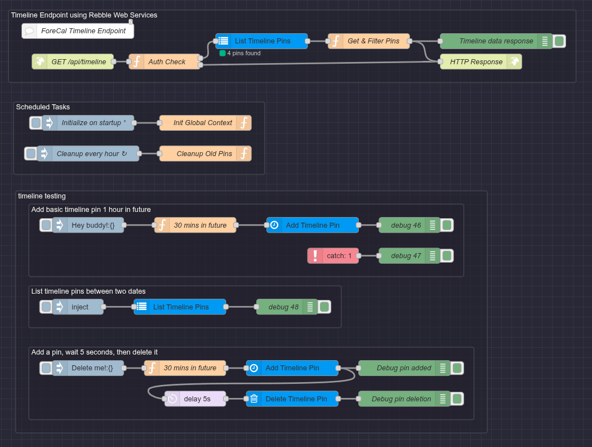

# Node-RED Setup Guide

This guide walks you through setting up Node-RED to serve timeline pins to ForeCal using the local Pebble Timeline emulation built into the `node-red-pebble-timeline` nodes. No token or Rebble Web Services are required.

## Example Flows

### Sync Home Assistant Calendar to Timeline

See [docs/timeline-sync/flows/sync-home-assistant-calendar-to-timeline.md](flows/sync-home-assistant-calendar-to-timeline.md) for a complete walkthrough and flow export.


## Prerequisites

- Node-RED installed and running
- ForeCal watch face installed on your Pebble
- Network access between your phone and Node-RED server
- The `@skylord123/node-red-pebble-timeline` nodes installed in Node-RED

## Installation

### Step 1: Install the Pebble Timeline Module

Install the `@skylord123/node-red-pebble-timeline` module in Node-RED:

**Via Palette Manager:**
1. Open Node-RED in your browser
2. Click the menu (top-right) → Manage palette
3. Go to the "Install" tab
4. Search for `@skylord123/node-red-pebble-timeline`
5. Click "Install"

**Via npm:**
```bash
cd ~/.node-red
npm install @skylord123/node-red-pebble-timeline
```

Then restart Node-RED.

### Step 2: Import the Endpoint Flow



1. Open Node-RED in your browser
2. Click the menu (top-right) → Import
3. Select "Clipboard"
4. Copy and paste the contents of [`flows/timeline-endpoint.json`](flows/timeline-endpoint.json)
5. Click "Import"
6. Click "Deploy"

This creates the `/api/timeline` endpoint that ForeCal will poll.

### Step 3: Configure Local Timeline Storage

1. In the imported flow, double-click the **"List Timeline Pins"** node
2. Next to the "Config" dropdown, click the pencil icon to add a new configuration
3. Give it a name (e.g., "Local Timeline")
4. Leave the token field empty
5. Leave the API URL field empty
6. Click "Add" then "Done"
7. Click "Deploy"

**Important:** All Pebble Timeline nodes in your flows must use the same configuration to share the local store. So go through all of them and make sure the config is the same.

### Step 4: Configure Authentication

The endpoint requires a Bearer token for authentication. By default, it's set to `example-token`.

1. Double-click the **"Auth Check (Optional)"** function node
2. Find the line: `const EXPECTED_TOKEN = "example-token";`
3. Change `example-token` to your desired secure token
4. Click "Done"
5. Click "Deploy"

Make sure to use the same token in ForeCal settings.

## Configure ForeCal

1. Open the Pebble app on your phone
2. Navigate to ForeCal settings
3. Scroll to "Remote Timeline Sync"
4. Enter your endpoint URL:
   ```
   http://YOUR-SERVER-IP:1880/api/timeline
   ```
5. Set your desired sync interval (default: 15 minutes)
6. Enter your Authorization Token (the one you set in the Auth Check node)
7. Save settings

## Testing

### Verify the Endpoint

Test your endpoint with curl (replace `your-token` with your actual token, if you enabled auth):

```bash
curl -H "Authorization: Bearer your-token" http://localhost:1880/api/timeline
```

You should see a JSON response with pins from the local timeline store:
```json
{"pins":[...]}
```

### Add a Test Pin

You can add pins to your timeline using the Pebble Timeline nodes from the `@skylord123/node-red-pebble-timeline` module:

1. Drag a **"Pebble Timeline Insert"** node into your flow
2. Configure it with your Local Timeline config
3. Connect an inject node that sends a payload like:

```json
{
  "id": "test-pin-001",
  "time": "2026-01-18T14:00:00Z",
  "layout": {
    "type": "genericPin",
    "title": "Test Pin",
    "subtitle": "From Node-RED",
    "body": "This is a test pin!"
  }
}
```

4. Deploy and click the inject button
5. Open settings for ForeCal watch face and hit save (this causes an immediate sync)
6. Check your timeline for the pin

### Verify on Watch

Wait for the next sync interval (Open settings for ForeCal watch face and hit save to force an immediate sync), and your pins should appear in the timeline.

## Adding Pins from Your Flows

### Using the Pebble Timeline Insert Node

The `@skylord123/node-red-pebble-timeline` module provides these nodes:

- **Pebble Timeline Insert** - Add or update a pin
- **Pebble Timeline Delete** - Remove a pin by ID
- **Pebble Timeline List** - Get all pins (used by the endpoint)

To add a pin from any flow:

1. Drag a **"Pebble Timeline Insert"** node into your flow
2. Configure it with your Local Timeline config
3. Connect it to a node that outputs a pin object:

```json
{
  "id": "unique-pin-id",
  "time": "2026-01-18T14:00:00Z",
  "layout": {
    "type": "genericPin",
    "title": "Event Title",
    "subtitle": "Optional subtitle",
    "body": "Optional description"
  }
}
```

### Using a Function Node

```javascript
msg.payload = {
    id: "my-custom-pin",
    time: new Date(Date.now() + 3600000).toISOString(), // 1 hour from now
    layout: {
        type: "genericPin",
        title: "Reminder",
        subtitle: "Don't forget!",
        body: "This is the full description text"
    }
};
return msg;
```

Then connect to a **"Pebble Timeline Insert"** node.

### Pin ID Best Practices

Use deterministic IDs based on the event identity:

```javascript
// Good - same event always gets same ID
const id = `calendar-${eventId}`;
const id = `reminder-daily-${dateString}`;
const id = `ha-entity-${entityId}-${state}`;

// Bad - generates new ID each time, creates duplicates
const id = `pin-${Date.now()}`;
const id = `pin-${Math.random()}`;
```

## Architecture Overview

```
Your Flows                     Local Timeline Store          ForeCal
    │                                   │                      │
    ▼                                   │                      │
┌─────────────┐                         │                      │
│ Pebble      │                         │                      │
│ Timeline    │─────────────────────────┤                      │
│ Insert Node │     write pins           │                      │
└─────────────┘                         │                      │
                                        │                      │
                              ┌─────────┴─────────┐            │
                              │ Local Timeline   │            │
                              │ Store (filesystem│            │
                              │  backed)         │            │
                              └─────────┬─────────┘            │
                                        │                      │
                                        │                      │
┌───────────────────────────────────────┼──────────────────────┤
│              Node-RED                 │                      │
│                                       │                      │
│  ┌──────────────────────────────┐     │                      │
│  │ GET /api/timeline endpoint   │◄────┘                      │
│  │  (List Timeline Pins node)   │         GET /api/timeline  │
│  └──────────────┬───────────────┘◄───────────────────────────┤
│                 │                                            │
│                 v                                            │
│          Filtered Pins ──────────────────────────────────────►
│                                                              │
└──────────────────────────────────────────────────────────────┘
```

## Troubleshooting

### Pins not appearing

1. Ensure all Pebble Timeline nodes use the same Local Timeline config
2. Verify the config node has an empty API URL
3. Check Node-RED logs for errors
4. Verify the endpoint returns valid JSON
5. Ensure the Node-RED process can write to its local storage
6. Ensure pin times are in the valid range (past 24h to future 7d)
7. Check the debug node output in Node-RED

### Authentication errors

- Ensure the token in ForeCal settings matches the `EXPECTED_TOKEN` in the Auth Check node
- Check that the Authorization header is being sent correctly

### Pins appearing but not updating

- ForeCal uses content hashing - only changed pins are updated
- The hash includes: `time`, `layout`, and `actions`
- Verify your pin ID is deterministic
