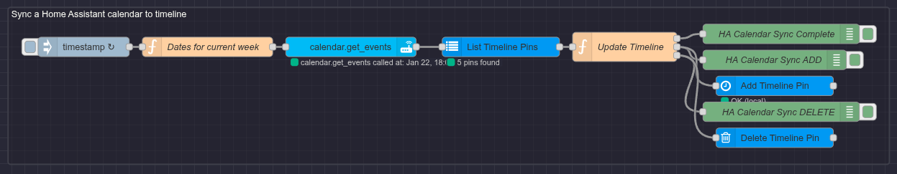

# Home Assistant Calendar -> Pebble Timeline (Node-RED Flow)

This flow syncs a Home Assistant calendar into the local Pebble Timeline store used by ForeCal. It pulls events from Home Assistant and turns them into timeline pins so they appear on your watch.

Flow file: `sync-home-assistant-calendar-to-timeline.json`

## Prerequisites

- Node-RED running (with the ForeCal timeline endpoint flow already set up)
- `@skylord123/node-red-pebble-timeline` installed
- Home Assistant installed and running
- `node-red-contrib-home-assistant-websocket` installed and configured to connect to your Home Assistant instance

## Install the Flow

1. Open Node-RED
2. Menu (top-right) -> Import -> Clipboard
3. Paste the contents of [`sync-home-assistant-calendar-to-timeline.json`](sync-home-assistant-calendar-to-timeline.json)
4. Click "Import"

## Required Configuration

### 1) Pick the Calendar (calendar.get_events node)

Open the **"calendar.get_events"** node and set it to the calendar entity you want to sync (for example, `calendar.family` or `calendar.work`). If you have multiple calendars, you can duplicate the flow.

You can also adjust the date range here to control how far ahead (or behind) the flow looks for events.

### 2) Customize Pin Creation (Update Timeline function node)

Open the **"Update Timeline"** function node and modify how pins are built from calendar events. This is where you decide:

- Layout type (`genericPin`, `calendarPin`, `reminderPin`)
- Icon (`tinyIcon`)
- Title/subtitle/body content
- Reminder timing or any actions

If you want reminders instead of calendar entries, generate `reminderPin` layouts and adjust the `time` field to the reminder time you want. If you want a custom icon, set `tinyIcon` to the resource name you want to display.

### 3) Use the Local Timeline Config

Make sure all Pebble Timeline nodes in the flow use the same Local Timeline config (empty API URL, empty token). That is what enables local storage and makes the pins available to ForeCal.

## Verify It Works

1. Deploy the flow
2. Trigger the flow (inject node or wait for the scheduler)
3. In ForeCal settings, hit save to force an immediate sync
4. Check your watch timeline for the new pins
